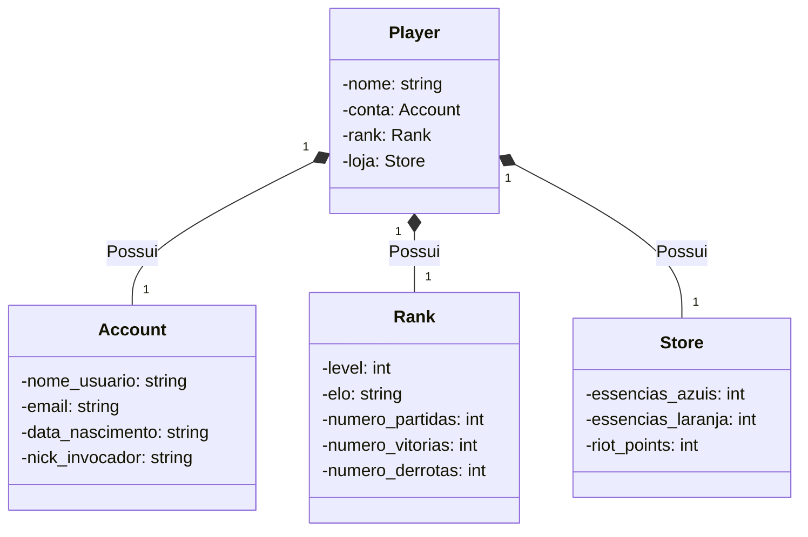

# DesafioAPIRestNaNuvem

## Diagrama de Classes

```mermaid
classDiagram
    class Player {
        -nome: string
        -conta: Account
        -rank: Rank
        -loja: Store            
    }

    class Account {
        -nome_usuario: string
        -email: string
        -data_nascimento: string
        -nick_invocador: string
    }

    class Rank {
        -level: int
        -elo: string
        -numero_partidas: int
        -numero_vitorias: int
        -numero_derrotas: int
    }

    class Store {
        -essencias_azuis: int
        -essencias_laranja: int
        -riot_points: int
    }      

    Player "1" *-- "1" Account : Possui
    Player "1" *-- "1" Rank : Possui
    Player "1" *-- "1" Store : Possui   

```
